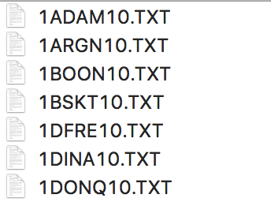
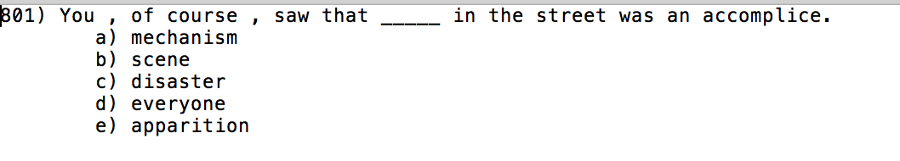

# Cloze-cloze
2018 下半学期、nlp作业
## 任务描述:
>给定训练集，完成dev集的选词填空

>训练集example:
>>

>dev集example:
>>
## 数据集描述:

Microsoft提出的特殊的数据集，用于证实n-gram模型的不足之处
  
reference: [A Challenge Set for Advancing Language Modeling](https://www.microsoft.com/en-us/research/wp-content/uploads/2016/02/holmes.pdf  )

## methods:

1. n-gram(n = 2,3,4,5): 
    * 平滑: +1:
      1. 句子概率
      2. 句子中n元组出现的次数乘积(频率)
    * 平滑: +0.5: 
      1. 句子概率
      2. 句子中n元组出现的次数乘积(频率)
2. gensim:
    * word2vec score, parameters: hs=1,negative=0,sample=0.001,window=10,size=300,min_count=10,workers = 7
    * predict_output_word, parameters: hs=1,window=10,size=300,min_count=5,workers =7

## Dependencies
* anaconda3
* jupyter notebook
* gensim

    conda install gensim
